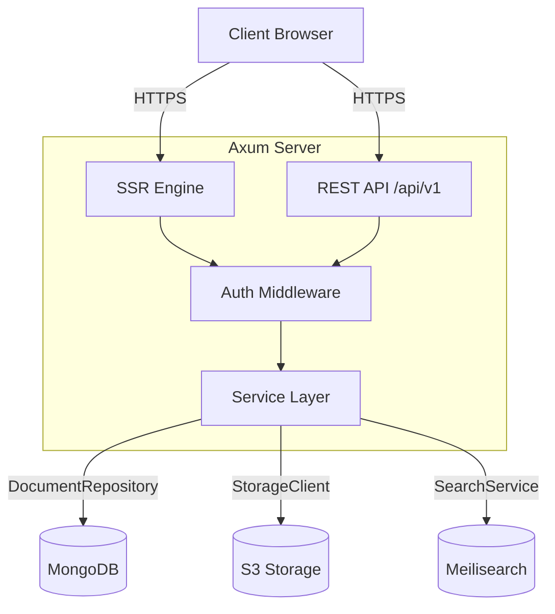
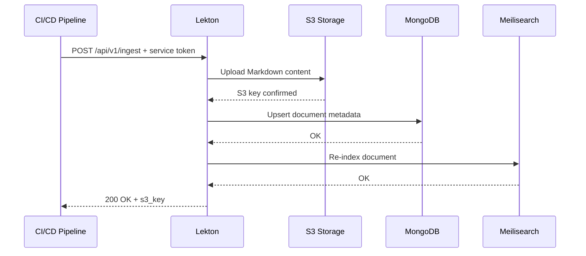

# Architecture Overview

This document describes the high-level architecture of Lekton and the design decisions behind it.

## System Diagram




## Design Principles

### 1. Decoupled Content Storage

Content (Markdown, schemas) is stored in **S3-compatible storage**, while metadata (titles, slugs, access levels, tags) lives in **MongoDB**. This separation allows:

- Independent scaling of storage and metadata
- Easy backup and migration of content
- Content versioning via S3 object versioning

### 2. Trait-Based Abstractions

All external services are accessed through Rust traits:

- `DocumentRepository` — MongoDB operations
- `StorageClient` — S3 operations
- Auth middleware — OIDC or demo mode

This enables mock-based testing without external dependencies.

### 3. Server-Side Rendering with Hydration

Lekton uses **Leptos** for SSR + client-side hydration:

1. Server renders the initial HTML for fast first paint
2. WASM hydrates the page for interactivity
3. Server functions handle authenticated data fetching

### 4. CI/CD-Native Ingestion

Documentation updates flow through the **Ingest API**, not through git commits to the portal:

```
Developer → git push → CI/CD → POST /api/v1/ingest → Lekton
```

This means a typo fix in one service's docs doesn't trigger a full portal rebuild.

## Technology Stack

| Layer          | Technology    | Purpose                              |
|----------------|---------------|--------------------------------------|
| Frontend       | Leptos 0.8    | SSR + Hydration, Component UI        |
| Styling        | Tailwind v4   | Utility-first CSS                    |
| Components     | DaisyUI 5     | Pre-built UI components              |
| Backend        | Axum 0.8      | HTTP routing, middleware             |
| Database       | MongoDB 7     | Metadata, RBAC policies             |
| Storage        | S3 (Garage)   | Markdown content, schema files       |
| Search         | Meilisearch   | Full-text search (Phase 2)           |
| Auth           | OIDC          | Identity federation                  |
| Build          | cargo-leptos  | Coordinated Rust + WASM build        |

## Data Flow: Document Ingestion



## Security Model

See [Security & RBAC](/docs/security-rbac) for the full security architecture.
