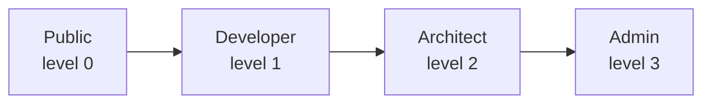
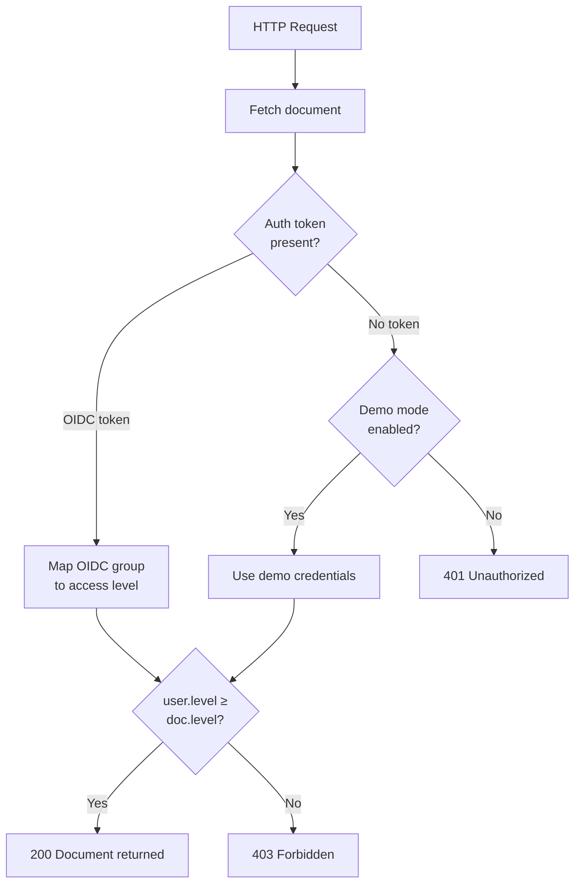

# Security & RBAC

This document describes Lekton's security model, including Role-Based Access Control (RBAC), authentication, and best practices.

## Access Levels

Lekton defines four hierarchical access levels:

| Level        | Numeric | Description                                    |
|-------------|---------|------------------------------------------------|
| **Public**      | 0       | Unrestricted — visible to everyone              |
| **Developer**   | 1       | Internal engineering documentation              |
| **Architect**   | 2       | Architecture decisions, system design docs      |
| **Admin**       | 3       | Sensitive ops docs, infrastructure secrets      |

### How Access Control Works

Every document has an `access_level` field. When a user requests a document:

**Example:** A user with `Developer` access can view documents with `Public` or `Developer` access, but not `Architect` or `Admin` documents.

## Authentication

### OIDC (Production)

In production, Lekton integrates with your existing identity provider via OpenID Connect:

- **Supported providers:** Keycloak, Auth0, Okta, Azure AD, Google Workspace
- **Claim mapping:** OIDC groups are mapped to Lekton access levels
- **Configuration:** Set via environment variables (`OIDC_ISSUER_URL`, etc.)

Group-to-role mapping:

| OIDC Group Claim | Lekton Role  |
|------------------|-------------|
| `admin`          | Admin       |
| `architect`      | Architect   |
| `developer`      | Developer   |
| *(any other)*    | Public      |

### Demo Mode

When `DEMO_MODE=true`, Lekton provides built-in credentials:

| Username | Password | Role       |
|----------|----------|------------|
| `demo`   | `demo`   | Developer  |
| `admin`  | `admin`  | Admin      |
| `public` | `public` | Public     |

> **Warning:** Never enable demo mode in production environments.

## API Security

### Service Tokens

The Ingest API (`POST /api/v1/ingest`) is authenticated via service tokens:

- Tokens are set via the `SERVICE_TOKEN` environment variable
- Each CI/CD pipeline should use its own token (Phase 2: per-service tokens)
- Tokens are validated server-side before any data is processed

### Best Practices

1. **Rotate tokens regularly** — Update `SERVICE_TOKEN` periodically
2. **Use HTTPS** — Always deploy behind TLS in production
3. **Principle of least privilege** — Assign the minimum access level needed
4. **Audit logging** — Monitor ingestion API calls (via `RUST_LOG=lekton=debug`)
5. **Network segmentation** — Keep MongoDB and S3 on internal networks

## Data Security

- **Content at rest:** Encrypted via S3 server-side encryption (SSE-S3)
- **Content in transit:** TLS between all services
- **Metadata:** MongoDB authentication and authorization enabled
- **Sessions:** HTTP-only, SameSite cookies (demo mode)
