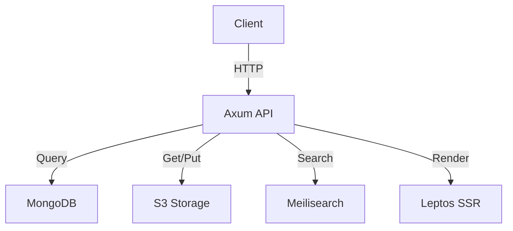

# Architecture

Lekton follows a Headless CMS architecture, separating content from code.

## Layers

-   **Storage Layer:**
    -   S3 (Minio) for storing markdown and schema artifacts.
    -   MongoDB for metadata and RBAC.
-   **Service Layer:**
    -   Axum handles authentication, ingestion, and search.
    -   Scoped by user roles.
-   **Presentation Layer:**
    -   Leptos for high-performance rendering (SSR + Hydration).

## Components

The main components are:
1.  **Frontend:** Leptos (Rust)
2.  **Backend:** Axum (Rust API)
3.  **Database:** MongoDB
4.  **Object Storage:** S3
5.  **Search:** Meilisearch

## Diagram

Here is a simplified diagram of the architecture:

